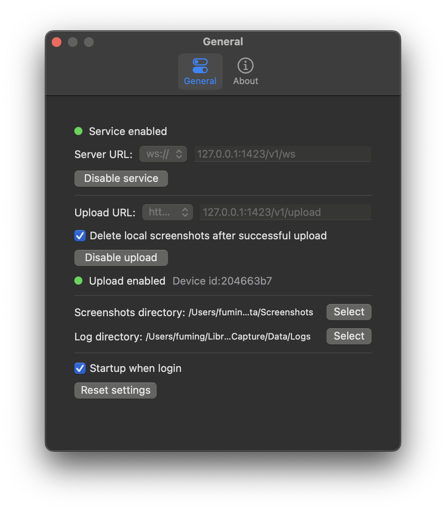

<h1 align="center">
   
  
   
ScreenCapture
   
</h1>

<h4 align="center">A screenshot tool that takes screenshots silently in the background and can automatically upload them to a specified server</a>.</h4>

</a>
</a>

 

## Screenshot

## TODO

+ Logging capability, which can be written into different files by day, and the latest log can be viewed directly in the application.

## LICENSE

Apache License
